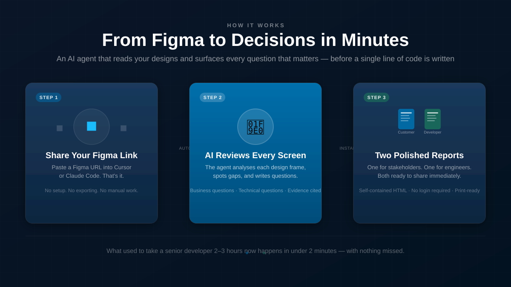
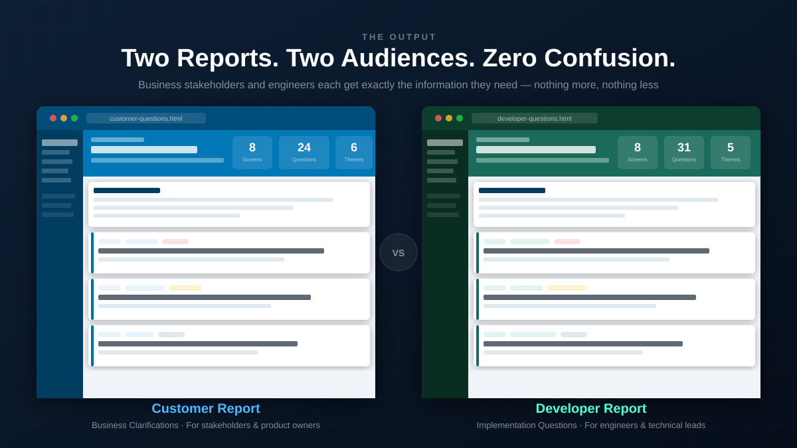
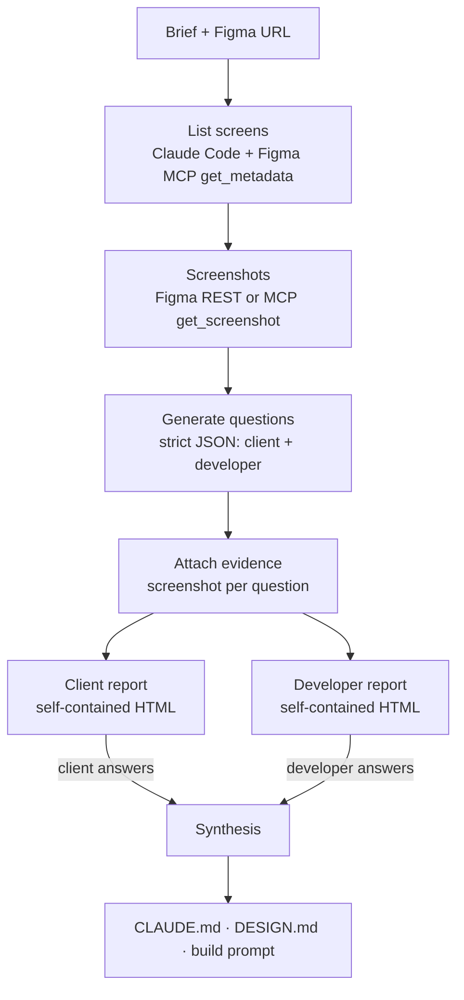

# Figma → spec agent

> Paste a Figma link. Get back the questions that need answering before anyone writes code: one report for the client, one for the developer.

> [!NOTE]
> This was built for client work, so the source is private. This repo explains what it does and how it's built.

## The problem

Design handoffs leave a lot unsaid: who's allowed to approve what, what happens on an error, which fields are required, what talks to which system. Normally a senior developer spends a couple of hours combing every frame for those gaps, and whatever they miss turns up mid-build as rework.

## What it does

You give it a Figma URL and a short brief. Claude Code reads the file through the **Figma MCP**, picks out the real screens and writes two separate sets of questions:

- **For the client:** plain-English multiple-choice questions to confirm flows, rules and permissions.
- **For the developer:** technical implementation questions.

Every question has a priority, a theme, a "why", and **evidence**: what in the design prompted it, shown next to a screenshot of that screen. For example:

> **Who is allowed to approve orders over $10,000?** · *High · Policy*
> *Evidence: the Approve button is shown without any role, threshold or policy hint.*
> ◯ Any approver ◯ Finance role only ◯ Two approvers above the threshold ◯ Other…

The client answers in the browser, and the answers flow back to the developer. The agent then turns the full set of answers into an implementation brief (`CLAUDE.md`), a `DESIGN.md` and a phased build prompt, ready for a coding agent to pick up.

## How it works

- **Screens first, then questions.** A first pass lists real UI frames and skips pages like "components", "archive" and "wip", capped at 12 screens per run. Screenshots are fetched in parallel and embedded straight into the reports.
- **Modes change what gets asked.** New build, legacy, duplicate or revamp (frontend-only or full-stack) each have their own scope rules, so it doesn't ask about decisions that are already fixed.
- **No API keys.** Every model call goes through the local `claude` CLI, with fallbacks to a separate Figma MCP client or a stub when needed.

## Engineering notes

- **A formal schema for questions.** Validation checks audience isolation (a client question can never land in the developer report), priority and signal types, timestamps, portable screenshot paths and node-ID normalisation.
- **Tested with `node:test`.** About 45 schema cases plus generator tests for audience isolation, option rendering and input immutability, all run against a generic fixture project.
- **Some wording is fixed in code on purpose.** The build prompt's phase structure and enforcement language are hard-coded, so an LLM can't soften the critical instructions.
- **Hardened server.** Request bodies are capped, CLI paths with shell metacharacters are rejected, slugs are sanitised and `</script>` breakouts are escaped when JSON is injected into HTML.
- **Two outputs, two builds.** A multi-page React workflow UI, plus a single-file Vite build so each report is one portable HTML file with no login.

## Real runs

| Screens | Client questions | Developer questions |
|---|---|---|
| 8 | 25 | 17 |
| 7 | 35 | 23 |

## Stack

Claude Code CLI · Figma MCP · Node.js · React · Vite · `node:test`
