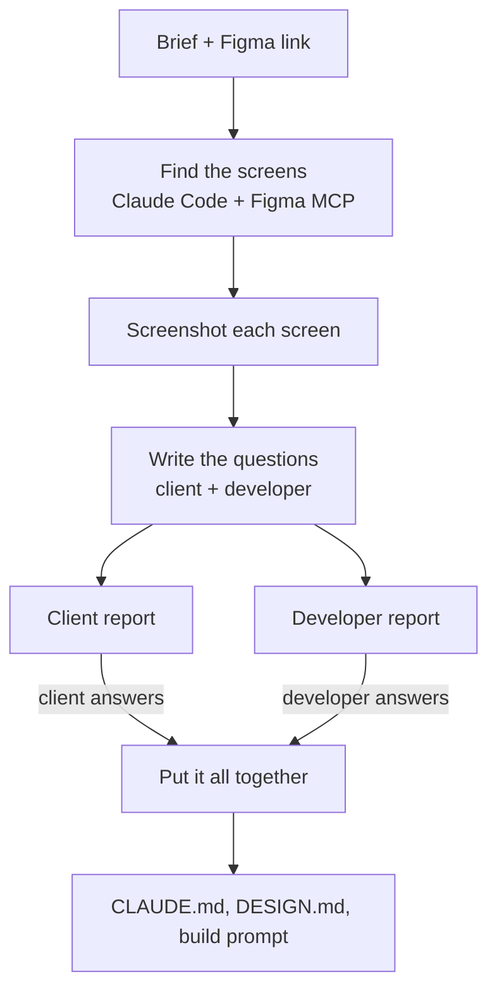

# Figma → spec agent

You give it a Figma link and a short brief, and it goes through the design and writes up the questions that need answering before anyone starts building.

I built it at work for client projects, so the code is private. This repo is a write-up of what it does and how it works.

## Why

Designs don't tell you everything: who can approve what, what happens when something fails, which fields are required. Normally someone has to go through every screen and pick all that out by hand, and whatever gets missed turns up halfway through the build.

## What it does

Claude Code reads the Figma file through the Figma MCP. It finds the actual screens (skipping pages like "components" or "archive"), grabs screenshots and writes two lists of questions:

- one for the client, in plain English and mostly multiple choice
- one for the developer, with the technical questions

Each question has a priority, why it matters and what in the design made it ask, next to a screenshot of that screen. Something like:

> **Who is allowed to approve orders over $10,000?** (high priority)
> The Approve button doesn't show any role, limit or rule.
> Any approver / Finance only / Two approvers over the limit / Other

The client answers in their browser, and the answers come back to the developer. Once everything's answered, it writes a CLAUDE.md, a DESIGN.md and a build prompt from the answers, so a coding agent can pick it up from there.

## How it works

A few things about it:

- The questions follow a schema, and there are checks so a client question never ends up in the developer report. There are about 45 tests on that.
- It doesn't use API keys. Everything runs through the `claude` CLI.
- The structure of the build prompt is hard-coded rather than generated, so the model can't water down the important instructions.
- There are modes for a new build, a legacy app, a duplicate or a revamp, and each one changes what it asks about. That way it doesn't ask about things that are already decided.
- It handles up to 12 screens per run. On real projects it's come out with around 40 to 60 questions across the two reports.

## Stack

Claude Code, Figma MCP, Node.js, React, Vite, `node:test`
